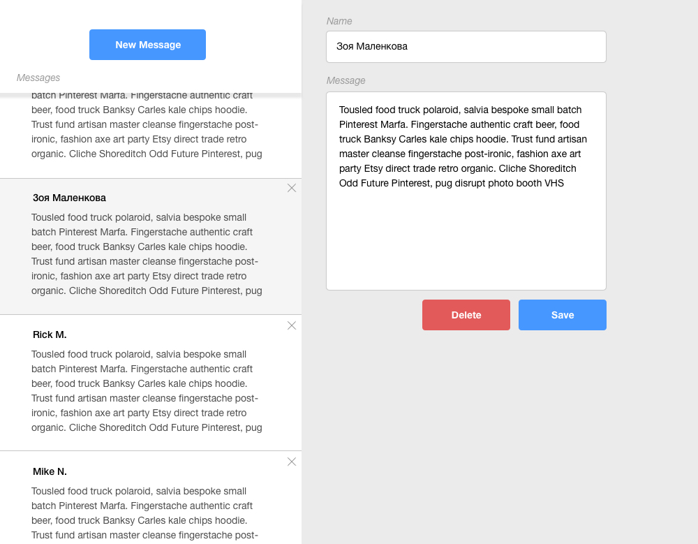

# ITSvit’s Comments SPA

## Description

Задан стандартный шаблон Create React Index.
Вам необходимо создать SPA для работы с комментариями на ITSvit.

## Requirements

-   Create React Index (v2+);
-   React v16+;
-   Axios;
-   SASS/SCSS/Stylus;
-   CRUD (Create / Read / Update / Delete).

## Would be a plus

-   Tests;
-   Redux;
-   React Router;
-   TypeScript;
-   Material UI.

## API

| Description                                         | Method | URL                                                       |
| --------------------------------------------------- | ------ | --------------------------------------------------------- |
| Перечень всех комментариев                          | GET    | http://comments.stage.itsvit.org/api/comments             |
| Получить описание выбранного комментария            | GET    | http://comments.stage.itsvit.org/api/comments/{idComment} |
| Создание нового комментария                         | POST   | http://comments.stage.itsvit.org/api/comments             |
| Обновление текста или автора выбранного комментария | PUT    | http://comments.stage.itsvit.org/api/comments/{idComment} |
| Удалить выбранный комментарий                       | DELETE | http://comments.stage.itsvit.org/api/comments/{idComment} |

### Создание нового комментария (params)

```json
{
    "author": "string",
    "text": "string"
}
```

### Обновление текста или автора выбранного комментария (params)

```json
{
    "author": "string",
    "text": "string"
}
```

## Design

Дизайн должен иметь схожую структуру, как показано на примере:


## How to deliver?

Создать Pull Request на ветку master.
